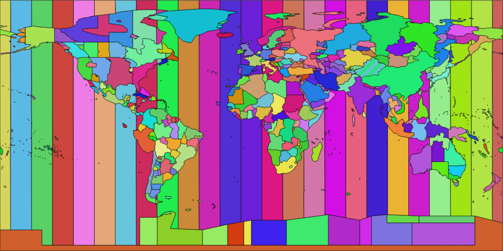
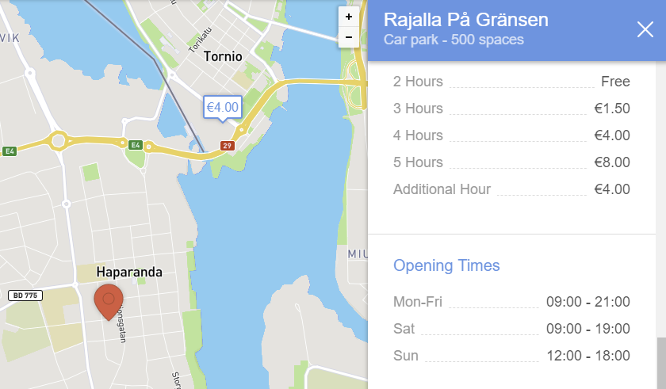
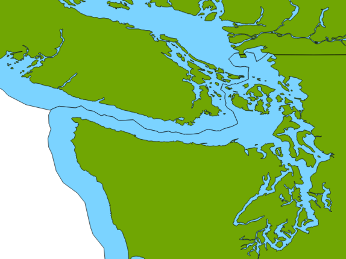
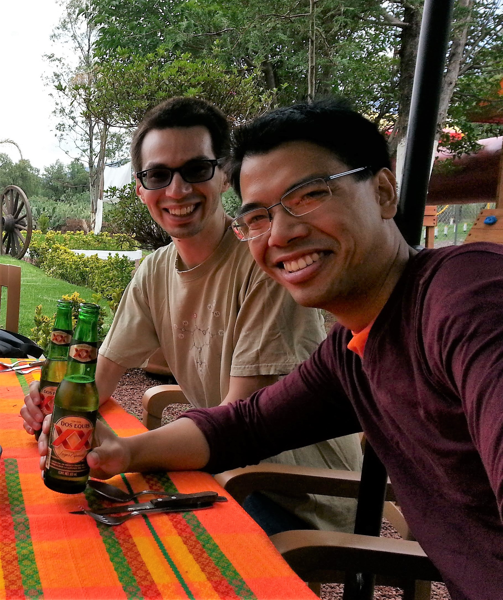

class: center, middle

# Henry Genet

### August 6, 2019

## [https://hygt.github.io/tz/](https://hygt.github.io/tz/)

???
This presentation isn't too technical as I wanted to keep the slides simple.
Don't hesitate and stop me any time if you have questions.

---

### About me

#### 2004 &mdash; 2010 | EPFL

* Studied computer science

#### 2009 &mdash; 2010 | MadeInLocal.com

* Think Foursquare, only less successful 😅

#### 2010 &mdash; 2015 | Samsung Electronics

* Firmware upgrades over-the-air
* Semantic web, open data
* Big data platform

#### 2015 &mdash; 2017 | HERE Technologies

* Web services for connected vehicles

#### 2017 &mdash; now | EPFL / Blue Brain Project

* Knowledge graph

???
Today I will talk about a feature that I implemented while working at HERE.
I was working on services for connected vehicles, that serve real-time information
about gas stations, electric charging points, parking garages and speed cameras.
If you aren't aware, the majority of car manufacturers work with HERE in a way or another.
If you have a recent German car that is connected, then you likely have access to these services.

---

### Commonality

--

POIs!

???
And here you should ask, where do you have POIs at the Blue Brain Project.
Actually a lot of people want to store 3D coordinates and run spatial queries.

---

### Today's topic

Most feared subject in the software industry:

???
According to me.

--

Dealing with time.

--

In particular: time zones.



???
Here you can see the state of time zones towards the end of 2018.
Each shape corresponds to a specific time zone "name" like Europe/Zurich for Switzerland.
Of course many of them actually represent the same time zone, like Western European countries.
But that wasn't necessarily always the case.

---

### Motivation

End users can search for several kinds of POI using their car's navigation system:

* Gas stations
* Electric charging points
* Parking garages

They might have *opening hours*.

Upstream data sources always provide information relative to local time.

What if you travel or live next to a time zone border? 🤯

???
Why do I need time zone information?
If you drive near a border and run a search, for instance for a parking garage, the navigation
system should be able to filter out the locations that are already closed.

---

### Real-life example: Swedish&ndash;Finnish border



Source: [Parkopedia](https://en.parkopedia.se/parking/carpark/rajalla_på_gränsen/95400/tornio)

???
And where does that happen in practice, well in Europe not so much, but you can see
a concrete example here. If you are in this Swedish city near the Finnish border and search
for a closed parking, the only result is actually beyond the border. And Finland is one hour
ahead of Sweden. It also uses a different currency, but that was another story, much easier
to implement.
By the way, I couldn't show you a screenshot of HERE maps since this kind of features aren't
available on the public website. But Parkopedia was one of our data provider, at least a the time.

---

### Time zones

* They tend to change frequently, in
  * Name
  * Shape
  * Rules
* Example: Russia repealed DST, chaos ensued, nearly a decade of changes:
  * Permanent summer time → permanent winter time.
  * Many cities switched back to "one hour before solar time".
  * 9 time zones → 11.

<video controls="controls" style="width: 50%">
  <source type="video/mp4" src="russia.mp4"></source>
</video>

Source: [Wikipedia](https://en.wikipedia.org/wiki/Time_in_Russia) and
[u/bellingo](https://www.reddit.com/r/MapPorn/comments/7npwnn/oc_changes_of_time_zones_of_russia_in_20142016_or/) on Reddit.

???
What's hard with dealing with time zones?
Well, they change pretty often, in name, shape and rules, for instance about daylight saving.
One infamous example, in 2009 I believe Putin decided to get rid of DST and simplify time zones.
First the entire country switched permanent summer time, then reverted to permanent winter time.
But a lot of places beyond Moscow wanted to get back to something closer to their previous time
zone, and Russia ended up with 11 ones, some of them covering basically just one city.

---

### Time zone database

* Published by IANA: [www.iana.org/time-zones](https://www.iana.org/time-zones).
* Cover past, present and future.
* Several revisions a year:
  * Typically around 100 changes in total worldwide, every year.
* Content is full of historical research and anecdotes:

```
# One further detail for Switzerland, which is probably out of scope for
# most users of tzdata: The [Europe/Zurich zone] ...
# describes all of Switzerland correctly, with the exception of
# the Canton de Genève (Geneva, Genf). Between 1848 and 1894 Geneva did not
# follow Bern Mean Time but kept its own local mean time.
# To represent this, an extra zone would be needed.
```

???
Where do you find authoritative data? The IANA (so the same people who allocate IP address blocks
 worldwide) publishes and maintains a database of time zones.
Each release covers the past, present and future state, at a given time.
If you diff these files one-by-one, there are many small changes every year.
I encourage you to have a look because it includes the historical research behind timezones
and it's full of anecdotes, like this one.

---

### Time zone database examples

Rule

```
# Rule	NAME	FROM	TO	TYPE	IN	ON	AT	SAVE	LETTER/S
Rule	Swiss	1941	1942	-	May	Mon>=1	1:00	1:00	S
Rule	Swiss	1941	1942	-	Oct	Mon>=1	2:00	0	-
```

Zone

```
# Zone	NAME		GMTOFF	RULES	FORMAT	[UNTIL]
Zone	Europe/Zurich	0:34:08 -	LMT	1853 Jul 16 # See above comment.
			0:29:46	-	BMT	1894 Jun    # Bern Mean Time
			1:00	Swiss	CE%sT	1981
			1:00	EU	CE%sT
```

Link

```
Link	Europe/Zurich	Europe/Busingen
```

???
And the actual content looks like this. There are three types of records per time zone.
Specific rules, here you can see that Switzerland observed DST for just one year, during
the World War 2.
Zone really defines the GMT offset, and you can see that before 1894 it wasn't an exact hour.
If I understand well, since 1981 the Swiss zone is the same as Central Europe Time.
And finally link. Büsingen is a German enclave in the canton of Schaffhausen, which followed the
Swiss time rather than the German one.

---

### A note on time zones on the JVM

* JRE and JDK's are shipped with a compiled version of IANA's database.
* Use an up-to-date distribution of your JVM!
* If that's not enough, there are standalone updaters made by JDK providers:
  * [Oracle](https://www.oracle.com/technetwork/java/javase/tzupdater-readme-136440.html)
  * [Azul](https://www.azul.com/products/open-source-tools/ziupdater-time-zone-tool/) (open source)
  * [Bell Soft](https://bell-sw.com/pages/iana-updater/)
  * ...
* There's an [open issue](https://github.com/AdoptOpenJDK/openjdk-build/issues/1057) regarding the state of things with AdoptOpenJDK 11+.

???
My ingestion services were running on the JVM. The first thing to make sure the database used
by the JVM is up-to-date. And if it's not, there are several tools that can compile IANA's
database. The issue with the tool from Oracle is that it works only for Oracle and
upstream OpenJDK distributions.
But there are alternatives and the issue with recent version of AdoptOpenJDK was raised,
I hope it'll get solved since the entire industry seems to converge there.

---

### The technical problem

Non-trivial volume of POIs, calling the internal geocoder for every one of them
was out of the question. Its batch API over REST was clunky to use.

I thought I could do better. 😎

???
While the static information related to the POIs wouldn't typically change much,
we'd still get updates once or twice a month. Meaning I would need
to reverse lookup time zones for thousands of POIs.
Of course, HERE has a team that runs a geocoder and reverse geocoder. They do provide
time zone information but it wasn't very convenient, as I need to chunk my requests in batches
and then poll until the result would be available.
Also it was sometime in August, the office was quiet and I didn't have more pressing issues.

---

### The initial solution

[GeoSense](https://github.com/eBay/geosense): Java package open sourced by eBay in 2013. There are
a few active forks, which bring small improvements. I used the one from
[Garmin](https://github.com/garmin/geosense).

It uses publicly available *shapefiles* of world time zones from [efele.net](http://efele.net/maps/tz/).

Performing a reverse lookup is as simple as this:

```java
TimeZone tz1 = GeoSense.getTimeZone(37.29390, -121.91413);
// returns America/Los_Angeles
```

In simple words, GeoSense:

* Parses geographic extents for all time zones into polygons (the one in Java AWT);
* Builds a whole-degree index (i.e. 360×180 tiles) of their bounding boxes;
* Returns the first time zone extent that contains the coordinates.

???
My initial solution was to use this library, written and open sourced by an eBay employee long ago.
It's not maintained anymore but there are several forks that fix the most obvious bugs.
It uses shapefiles published by a French guy called Eric Muller.

---

### Issue

A lot of POIs are near the coastline.

Shapefiles resolution wasn't high enough, some lookups failed, as if the POIs were in the water.

???
Yet it didn't work for all my POIs. As you probably realize, a lot of the world population lives
near the coastline. That means a lot of POIs are close to the see. If the resolution of your
shapefiles is not good enough, many lookups will fail.

---

### Solution



[Modded shapefiles](https://github.com/gregology/territorial-timezones) that include territorial waters.

Source: [question on StackExchange](https://gis.stackexchange.com/questions/201072/timezone-map-including-territorial-waters)

???
So I thought, what if I had shapefiles that also contain surrounding waters, i.e. territorial
waters. And I found someone on StackExchange who asked the same thing. And he actually replied
to his own question once people gave him ideas about the best approach, and published everything
on GitHub. He should win an award as the most useful StackExchange user.

---

### State of the art

* Shapefiles at [efele.net](http://efele.net/maps/tz/) aren't updated anymore.
* Fortunately, you can build shapefiles from Open Street Map data: [timezone-boundary-builder](https://github.com/evansiroky/timezone-boundary-builder)
* Several lookup libraries implemented in different languages.
* One in Java: [Timeshape](https://github.com/RomanIakovlev/timeshape)
  * Written by a former co-worker.
  * Uses Esri Geometry API for Java (proper library with parsers, geometries, spatial operations, quad-tree, ...)
  * GeoJSON shapes are serialized with Protobuf and compressed using ZSTD, to produce a 19 MB self-contained JAR.
* Alternatively, nowadays a lot of databases support GIS data, and you could simply load shapefiles into your favorite one.

???
What if I had to do the same thing today. Unfortunately the shapefiles on that website aren't
updated anymore, because the author thinks you should use Open Street Map instead.
You need two things for that, one is a Javascript tool that extract GeoJSON shapes from the OSM 
data. Then you have several lookup libraries, in Javascript, Go, and so on.
The one I found in Java is actually written by a former co-worker. So that tells me he probably
got rid of my solution for something more robust.
What's interesting is that it uses a proper library to parse and index the shapes.
And also it serializes the GeoJSON in Protobuf, so that you can embed everything as a dependency.
Something I didn't consider at the time but which could also make sense if you need it as part
of an ingestion pipeline, many databases nowadays support geographical data, and you could simply
load the shapes into Postgres or MySQL.

---

### Scala tooling

* Time zone database parser: [github.com/cquiroz/kuyfi](https://github.com/cquiroz/kuyfi)
* Pure Scala implementation of `java.time` [github.com/cquiroz/scala-java-time](https://github.com/cquiroz/scala-java-time)

???
Finally, as an aside, if you ever need to parse and deal with the IANA releases directly, I found
this parser pretty good. I've used it recently to compute the differences between revisions within
recent years, that's how I counted roughly a 100 changes a year.
The same author maintains a reimplementation of java.time package in pure Scala, which is important
for Scala.js and Scala native.

---

### Questions?



I don't always drink beers in Mexico with Jérémy, but when I do...
